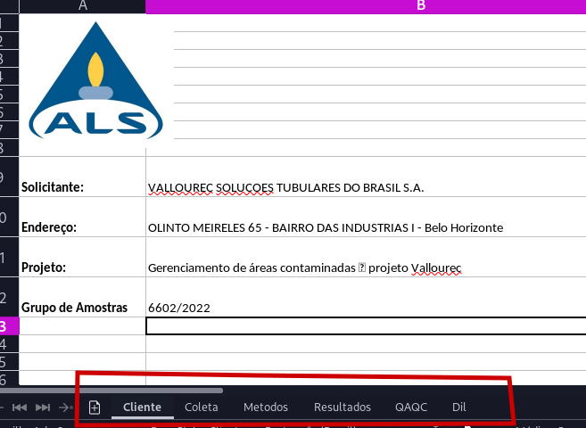

# Introduction

This module contains tools to format and transform ALS report filex in xlsx that looks like the image below.

ALS has a standard report format that can be transformed to an EDD format accepted by EQuIS software.
This module is mainly designed  to transform and aggregate the necessary data into a single standard spreadsheet that can be converted later to an EDD using separate modules.
